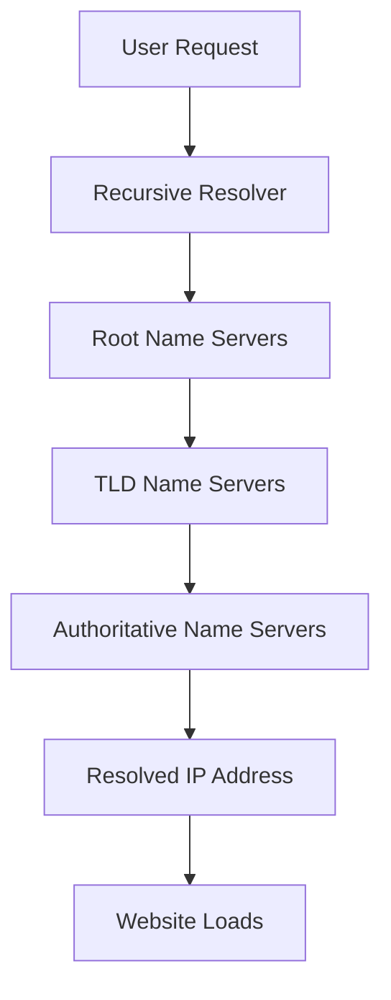

# Why Networking Matters in System Design?

- Every system relies on data exchange between components
- Networking enables scalability, reliability and performance
- Key areas where networking plays a crucial role:
	- Communication : Ensuring smooth data transfer between clients, servers and databases
	- Load Balancing:  Distributing traffic efficiently to prevent overload on a single server
	- Security: Protecting data from unauthorized access and cyber threats
	- Efficiency: Optimizing network performance to reduce latency and improve user experience

# How Networking Impacts Large-Scale Systems
- Helps handle millions of users concurrently
- Enables fast and efficient data exchange
- Reduces latency & improves system resilience
- Essentials for cloud computing & distributed system

# Agenda: Key Networking Concepts in System Design
- Understanding IP Addresses
- How DNS Works
- Client-Server Model Explained
- Forward Proxy vs. Reverse Proxy
- Introduction to Load Balancing
- What is an API Gateway?
- Content Delivery Networks (CDN) in System Design

# IP Addressing

- IP(Internet Protocol) address are unique numerical identifier assigned to every device that is connected  to internet
- They enable devices to exchange information seamlessly
- They enable communication between different machines, servers and services across internet.
- Two primary versions:
	- IPv4
	- IPv6

### IPv4

- It is most widely used addressing system.
- 32-bit address format(e.g., 192.168.1.1)
- Total addresses available: ~4.3 billion
- Uses: Traditional networking, web servers, and most current internet devices.
- Challenges: Limited IPs, fragmentation , and security concerns

### IPv6

- It is next-generation IP standard.
- 128-bit address format 
- It uses Hexadecimal notation separated by colons
- Total addresses available: 340 undecillion (virtual unlimited)
- Designed for: IoT, mobile networks and future scalability.
- Key benefits: Larger address space, better security and improved routing efficiency

### Private vs. Public IPs
- ### Public IPs:
	- Assigned by ISPs (Internet service providers ).
	- Used to communicate over the internet.
	- Unique worldwide.
	- Example : 192.203.23.45
- ### Private IPs:
	- Used within local networks(LANs, enterprises, homes).
	- Cannot be accessed directly from the internet.
	- examples:
		- 10.0.0.0 - 10.255.255.255
		- 172.16.0.0 - 172.31.255.255
		- 192.168.0.0 - 192.168.255.255
## Why do we need private IPs?
- Conserves public IP addresses (IPv4 limitation)
- Enhances security (private IPs are not routable over the internet).
- Enables Network Address Translation (NAT) to allow multiple devices to share a single public IP.
- Common in corporate networks, data centers, and cloud environments.

## The Role of IPs in System Design

- **Scalability** : Helps in designing distributed, multi-region, and cloud-based architectures.
- **Security:** Enables firewall rules, VPNs, and private networking.
- **Load Balancing:** Uses IP-based traffic distribution(e.g., Round-robin DNS, Anycast IPs).
- **Cloud Networking:** Public, private, and hybrid cloud IP management (AWS, GCP, Azure)
- **Microservices & Containers:** Use internal private IPs for communication

## Common System Design Interview Question on IPs
- How do IPv4 and IPv6 address differ?
- Why do we need private IPs in system design?
- How does NAT help in addressing in IPv4 shortage?
- Explain how a load balancer distributes traffic using IPs.
- How does DNS resolve IP addresses in large-scale system?

# How DNS Works

- **What is DNS?**
	- The "Phonebook of the internet."
	- Translates human-readable domain names (e.g., google.com) into IP addresses.

## Type of DNS Servers

- **Root Name Servers:** Top-level servers handling .com, .org, etc.
- **TLD Name Server:** Specific to domains like .com, .net
- **Authoritative Name Servers:** Store domain-specific records.
- **Recursive Resolvers:** Handle queries on behalf of users, contacting multiple DNS servers if necessary

